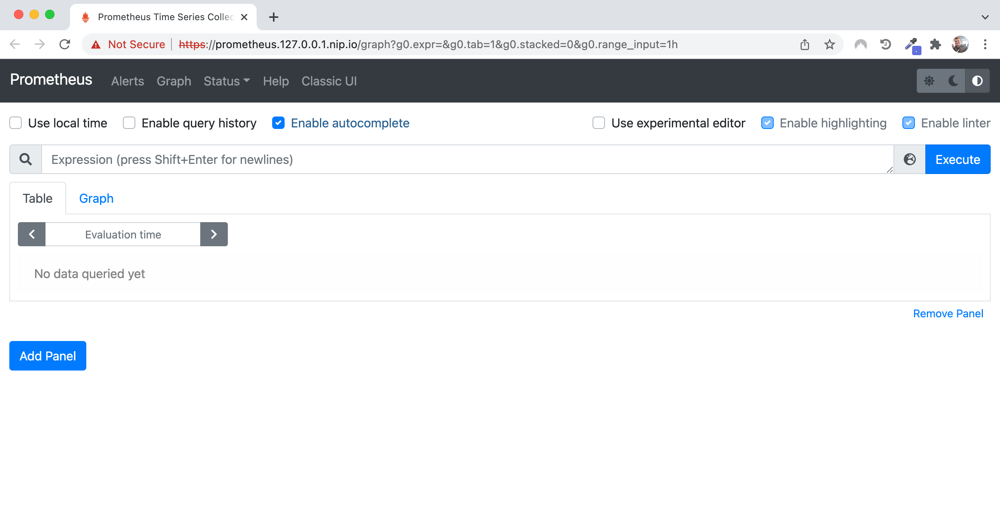
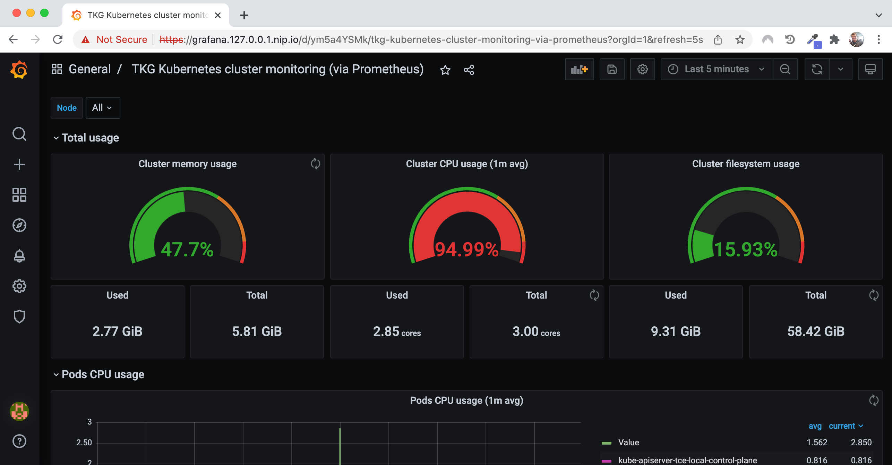
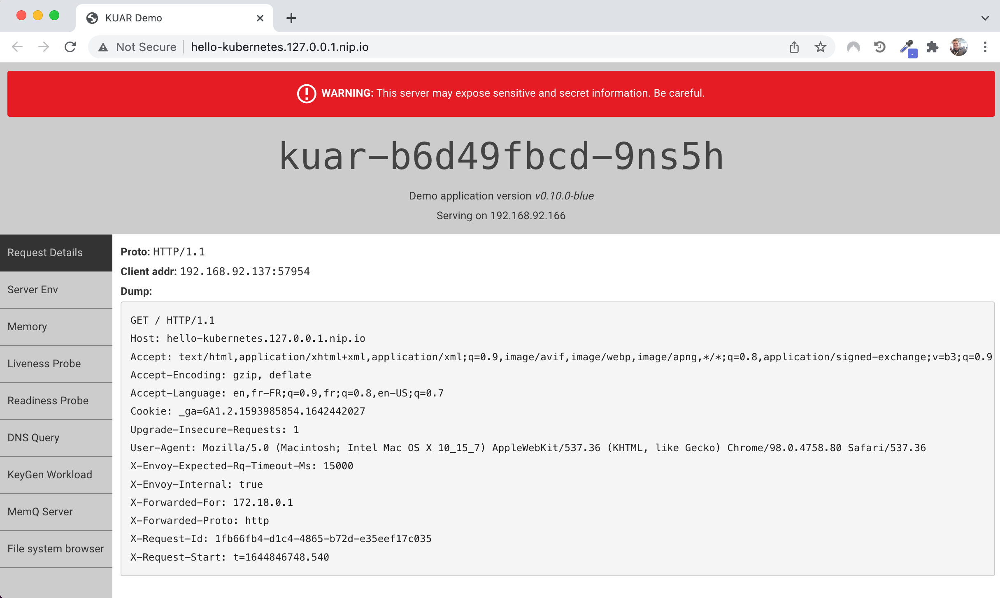
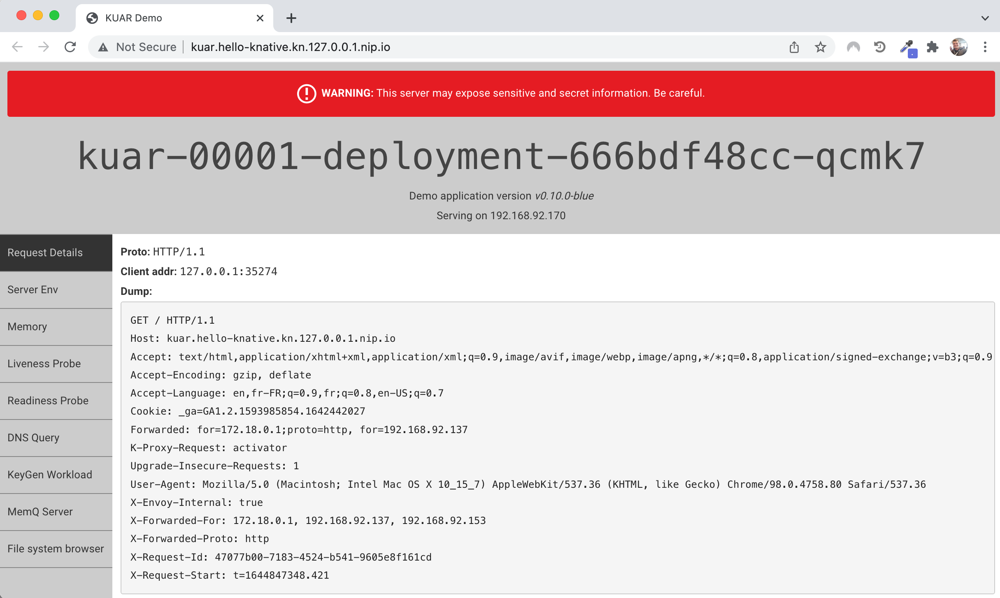

# Running Tanzu Community Edition on your local workstation

This projects describes how to run [Tanzu Community Edition](https://tanzucommunityedition.io/) (TCE),
a free Kubernetes distribution leveraging open source technology, on your local workstation.


Wanna learn Kubernetes? Search no more: TCE is a great way to start using Kubernetes
without having to rely on a cloud provider or an on-premise infrastructure.
Just create a local Kubernetes cluster on your workstation, and you're ready to go.

There are also great online workshops to learn about Kubernetes at
[learn.tanzu.io](https://learn.tanzu.io).

## How to use it?

### Installing TCE

Make sure you have a Docker daemon running. You may use Docker Desktop if applicable.

[Follow these steps](https://tanzucommunityedition.io/docs/latest/cli-installation/)
to download and install TCE on your workstation.

**Note** Please use at least
[version 0.11+](https://github.com/vmware-tanzu/community-edition/releases/tag/v0.11.0), as
this guide relies on the `unmanaged-cluster` plugin.

After installing TCE, run this command to check everything is ready:

```shell
tanzu unmanaged-cluster --help
```

If there is no error at this point, then you're good to proceed further.

### Creating your local Kubernetes cluster

Run this command to create a local Kubernetes cluster:

```shell
tanzu unmanaged-cluster create tce-local -p 80:80 -p 443:443 --additional-repo projects.registry.vmware.com/tce/main:v0.12.0 --additional-repo ghcr.io/alexandreroman/tce-local
```

**Note** This command installs the `tce-local` package repository,
which includes a set of pre-configured packages, tailored for local use.

**Note** Edit the `tce-main` package repository version in this command
with the TCE version you're using.

**Note** Ports `80` and `443` must be available on your workstation, as these ports
will be used to get access to your Kubernetes apps.

This command may take some time, as the installation process
needs to download base images.

Run this command after installation:

```shell
tanzu unmanaged-cluster list
```

Here's the output of the previous command:

```shell
NAME       PROVIDER
tce-local  kind
```

You can now access your cluster with `kubectl`, or any tools leveraging
the Kubernetes API:

```shell
kubectl get po -A
```

At this point you have a local Kubernetes cluster up and running.
We're about to install additional components.

### Deploying core components

The `tce-local` package repository includes a set of pre-configured packages, so that you
can use this Kubernetes cluster locally right away.

Here are the packages available in this repository:

- `local-core`: base package including
  [cert-manager](https://tanzucommunityedition.io/docs/latest/package-readme-cert-manager-1.5.4/),
  [Contour](https://tanzucommunityedition.io/docs/latest/package-readme-contour-1.19.1/) (ingress controller) and
  [Metrics Server](https://github.com/vmware-tanzu/community-edition/tree/main/addons/packages/metrics-server/0.5.1), with a default configuration suited for local use
- `local-monitoring`: package including
  [Prometheus](https://tanzucommunityedition.io/docs/latest/package-readme-prometheus-2.27.0/) /
  [Grafana](https://tanzucommunityedition.io/docs/latest/package-readme-grafana-7.5.7/)
- `local-knative`: package including
  [Knative Serving](https://tanzucommunityedition.io/docs/latest/package-readme-knative-serving-1.0.0/)

Make sure the package repository is fully reconciled:

```shell
tanzu package repository get tce-local -n tanzu-package-repo-global
```

Deploy the `local-core` package:

```shell
tanzu package install local-core --package-name core.local.community.tanzu.vmware.com --version 1.0.0
```

Check that you have new pods running in namespaces `cert-manager` and `contour`:

```shell
kubectl get po -A
```

You may start using your local Kubernetes cluster: other packages are not
strictly required in order to deploy and access Kubernetes apps.
Jump to the [Deploying apps to your local Kubernetes cluster](#deploying-apps-to-your-local-kubernetes-cluster) section to deploy your first Kubernetes app.

### Deploying monitoring tools

Prometheus and Grafana are often used with Kubernetes to get metrics out of your apps / cluster.
The `tce-local` package repository includes a package with a pre-defined configuration suited
for your local cluster.

Deploy the `local-monitoring` package:

```shell
tanzu package install local-monitoring --package-name monitoring.local.community.tanzu.vmware.com --version 1.0.0
```

Now you have new namespaces: `prometheus` and `grafana`.

Access your Prometheus server at: http://prometheus.127.0.0.1.nip.io.



Grafana is available at: http://grafana.127.0.0.1.nip.io (user: `admin`, password: `admin`).



### Deploying Knative

[Knative is a famous framework for Kubernetes apps](https://tanzu.vmware.com/developer/guides/knative-serving-wi/),
allowing you to leverage scale-to-zero patterns to better use cluster resources.
It's also a great way to simplify app deployment with Kubernetes,
by reducing the number of YAML files (always a great point!).

Run this command to deploy Knative:

```shell
tanzu package install local-knative --package-name knative.local.community.tanzu.vmware.com --version 1.0.0
```

In a matter of minutes, you'll be able to deploy scale-to-zero apps thanks to TCE and
this opinionated package.
Your Knative services will be available under `<name>.<ns>.kn.127.0.0.1.nip.io`.

### Deploying all packages

Looking for a quick way to deploy all packages? I've got you covered!

Use this command to deploy all packages tailored for local use to your cluster:

```shell
kubectl apply -f https://raw.githubusercontent.com/alexandreroman/tce-local/main/tce-local-install-all.yml
```
You can follow the deployment of the packages by using this command:
```shell
tanzu package installed list
```

## Deploying apps to your local Kubernetes cluster

So, you have your Kubernetes cluster up and running on your workstation, now what?
Time to deploy sample apps!

### Say hello to Kubernetes!

Run this command to deploy a simple Kubernetes app with 2 replicas:

```shell
kubectl apply -f samples/hello-kubernetes/config
```

The app is available at http://hello-kubernetes.127.0.0.1.nip.io.



### Scale-to-zero with Knative

Thanks to Knative, you can build scale-to-zero apps, while simplifying deployment:
just declare a Knative Service, and forget about everything else
(`Deployment`, `Service`, `Ingress`)...!

Run this command to deploy a simple Knative Service:

```shell
kubectl apply -f samples/hello-knative/config
```

This command will deploy an app under: http://kuar.hello-knative.kn.127.0.0.1.nip.io.



As you can see, this is basically the same app you've deployed in the previous section.

What's the main difference? **50% less YAML!** 😎

Bonus point: you also get scale-to-zero for free. If you don't touch the app
for about 2 minutes, pods will be destroyed (down to zero instances).
As you start using this app again, new pods will be created (up to 10 instances).

Have fun!

## Contribute

Contributions are always welcome!

Feel free to open issues & send PR.

## License

Copyright &copy; 2022 [VMware, Inc. or its affiliates](https://vmware.com).

This project is licensed under the [Apache Software License version 2.0](https://www.apache.org/licenses/LICENSE-2.0).
